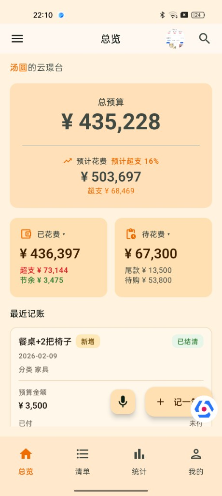
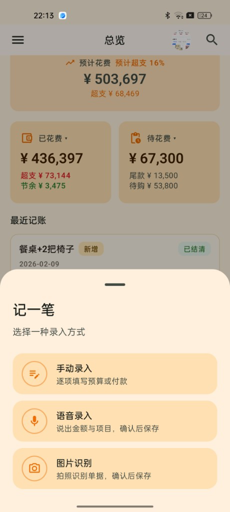
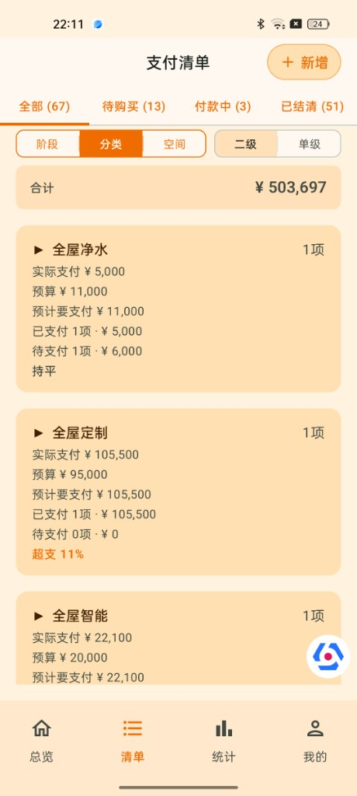
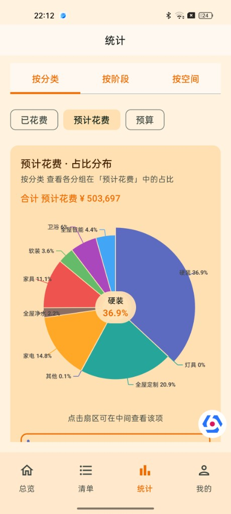
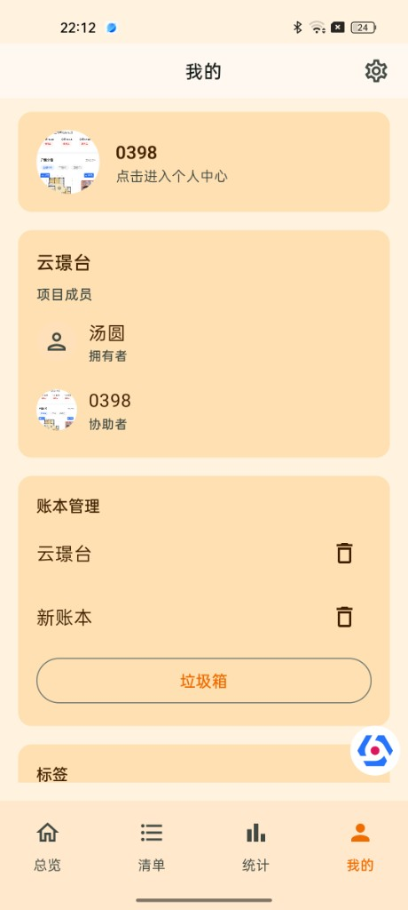
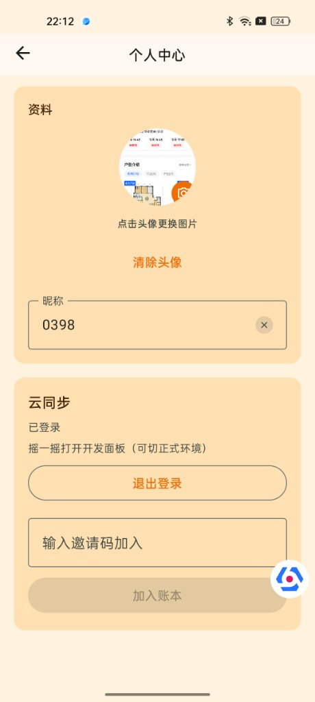

# 装修记账 · Android

面向夫妻 / 家人的**装修预算 + 付款追踪** App。一眼看清：已经付了多少、还要花多少、买完会不会超。

本仓库是 **Android 客户端**。同一套产品还有：

| 端 | 仓库 |
|---|---|
| 微信小程序 | [renovation-ledger-miniprogram](https://github.com/lixiangyi/renovation-ledger-miniprogram) |
| 云端 API | [renovation-ledger-server](https://github.com/lixiangyi/renovation-ledger-server) |

当前版本 **v0.1.0**：本地记账始终可用；登录后可云同步、邀请家人协作。

---

## 界面预览

<p>
  
  
  
</p>
<p>
  
  
  
</p>

| 截图 | 说明 |
|------|------|
| 总览 | 总预算、预计花费、已花费 / 待花费、最近记账 |
| 记一笔 | 手动 / 语音 / 图片识别录入入口 |
| 支付清单 | 状态筛选、阶段/分类/空间分组与合计 |
| 统计 | 按分类看预计花费占比（可点扇区） |
| 我的 | 成员角色、账本管理、垃圾箱入口 |
| 个人中心 | 头像昵称、登录状态、邀请码加入 |

---

## 为什么做这个

通用记账和部分装修 App 常见痛点：

1. **总预算与分项对不上** — 不知道分项加起来是不是总预算  
2. **付款状态糊在一起** — 定金、尾款、还没买的混为一谈  
3. **口径说不清** — 回答不了「现在花了多少 / 还要付多少 / 买完会不会超」

本产品以**财务模型 + 总览指标**为核心，不做装修公司对接、不做优惠导购。

---

## 核心概念（30 秒）

| 概念 | 说明 |
|------|------|
| **账本** | 一套房 / 一次装修对应一个账本；支持多账本 |
| **预算项** | 一条分项（如「全屋定制」），可挂多笔付款 |
| **三态** | **待购买** → **付款中** → **已结清** |
| **付款** | 已付 / 未付；支持定金、尾款等 |
| **总预算** | 各预算项「预算金额」之和 |
| **已实付** | 所有「已付」付款之和 |
| **待花费** | 待付尾款 + 待购买金额 |
| **预计花费** | 按当前合同/预算口径推算的买完总花费 |
| **超支 / 节余** | 相对总预算：当前（已实付）与预计两套口径；单项也可看「已付 vs 预算」 |

---

## 功能

### 四个主 Tab

**总览**

- 总预算、已花费、待花费、预计花费；健康色主题（绿 / 橙 / 红，可关）
- 已花费展开：单项超支 / 节余；待花费展开：尾款 / 待购买
- 最近记账
- 标题行展示**账本拥有者** + 账本名称（登录后只列出当前账号可见的账本）
- 侧滑抽屉：切换 / 新建 / 重命名 / 删除（进垃圾箱）
- 语音助手 + **记一笔**

**清单**

- 按阶段 / 分类 / 空间分组，二级或单级布局
- 状态筛选：全部 / 待购买 / 付款中 / 已结清
- 进入详情增改付款、改预算项

**统计**

- 按分类 / 阶段 / 空间聚合
- 饼图指标可切：已花费 / 预计花费 / 预算
- 柱状对比、合同超预算 TOP5

**我的**

- 进入**个人中心**（头像、昵称、登录 / 退出、邀请码）
- 协作成员列表（拥有者 / 协助者）
- 预算健康色开关、「轻度超支」橙色上限（默认约 15%）
- 标签管理、导出 / 导入 CSV、垃圾箱、设置

### 账号与协作

- **手机号验证码**登录、**微信**登录（需开放平台配置）
- 新用户默认昵称形如 `momo-xxxx`（手机号后四位），可在个人中心改
- 登录后同步当前账号下的云端账本；协助者只能看到被邀请加入的账本
- **拥有者**可生成邀请码；对方预览确认后再加入
- 协助者退出不影响拥有者；拥有者删除账本会软删云端

### 记一笔与语音

- 手动新建预算项，或给已有项记一笔付款
- 详情页：付款列表、补记、标记结清、编辑 / 删除
- 语音：录音 → 百炼 ASR 转写 → 大模型意图 → **确认后再落账**（不会静默入账）
- 设置里可配置 DeepSeek / 百炼 Key（本机保存）

### 数据

- Room 本地库；变更后自动备份 CSV
- 冷启动优先展示本机数据，再后台拉云端，避免先闪「无数据」
- 删除账本先导出再进垃圾箱，可恢复

---

## 预算健康色

跟随**预计超支相对总预算**的比例：

| 状态 | 含义（默认可调） |
|------|------------------|
| 绿 | 预算内或未超支 |
| 橙 | 轻度超支（默认不超过预算 15%） |
| 红 | 重度超支（超过上述比例） |

可在「我的」关闭整页换色；关闭后列表里的超支/节余金额仍可用红/绿提示。

---

## 技术栈

- Kotlin · Jetpack Compose · Material 3
- Navigation Compose · Hilt · Room · DataStore
- Retrofit / OkHttp · Gson · MPAndroidChart
- 语音：DashScope ASR + LLM 工具调用

---

## 快速开始

**环境：** JDK 17、Android SDK、已连接设备或模拟器（`adb devices` 可见）

```bash
git clone https://github.com/lixiangyi/renovation-ledger.git
cd renovation-ledger
sh oneClickSetup
```

脚本会：`gradlew clean` → `assembleDebug` → `adb install -r` → 启动主界面。

也可以用 Android Studio 打开本仓库，选 `app` 模块 Run。

云同步需自行部署 [renovation-ledger-server](https://github.com/lixiangyi/renovation-ledger-server)，并在 App 设置里填写服务地址。

发布签名见 `keystore/README.md`（`.jks` 不入库）。

---

## 仓库结构（摘要）

```
app/src/main/java/com/renovation/ledger/
  data/          Room · 同步 · CSV · Prefs
  domain/        模型 · 指标 · 账本可见性 / 角色
  ui/            总览 / 清单 / 统计 / 我的 / 个人中心 / 详情 / 录入
  voice/         ASR · 意图 · 工具执行
docs/superpowers/  设计与实现计划
oneClickSetup      一键编译安装
```

---

## 设计原则

- **先确认再落账**：语音不得自动静默入账
- **口径可解释**：总览数字能追溯到预算项与付款状态
- **本地可用**：未登录也能记账；登录后云端对齐
- **导入不污染**：CSV 导入默认写入新账本

---

## License

尚未指定开源协议；默认仅作个人 / 协作项目使用。
